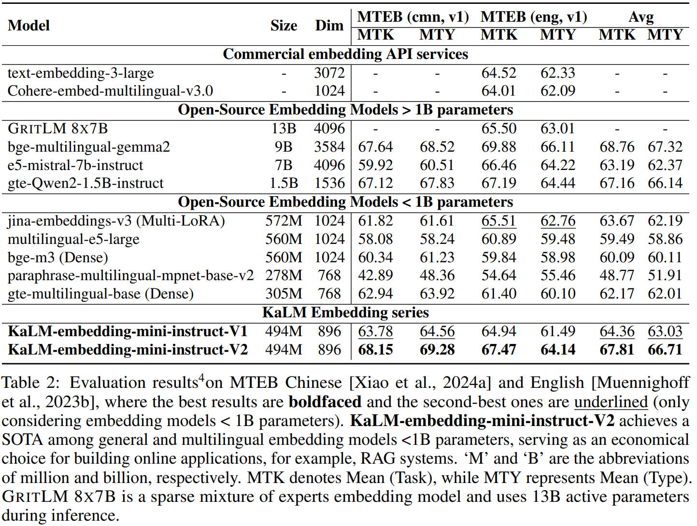
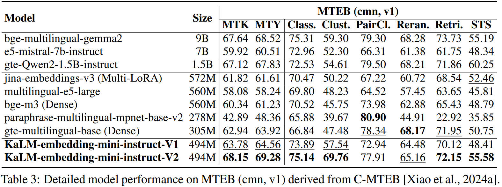
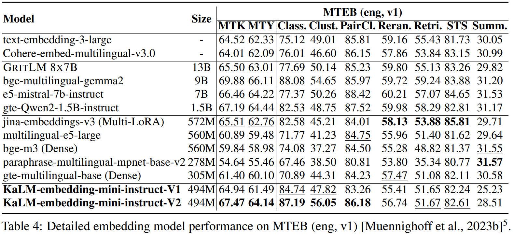

<h1 align="center">KaLM-Embedding</h1>

<div style="text-align: center;" align="center">
  
</div>


<h4 align="center">

  [Overview](https://github.com/HITsz-TMG/KaLM-Embedding/tree/main?tab=readme-ov-file#sparkles-overview) | [Features](https://github.com/HITsz-TMG/KaLM-Embedding/tree/main?tab=readme-ov-file#zap-features) | [Usage](https://github.com/HITsz-TMG/KaLM-Embedding/tree/main?tab=readme-ov-file#computer-usage) | [Acknowledgements](https://github.com/HITsz-TMG/KaLM-Embedding/tree/main?tab=readme-ov-file#loudspeaker-acknowledgements) | [Citation](https://github.com/HITsz-TMG/KaLM-Embedding/tree/main?tab=readme-ov-file#link-citation) | [License](https://github.com/HITsz-TMG/KaLM-Embedding/tree/main?tab=readme-ov-file#scroll-license)

</h4>


## :sparkles: Overview

Code for training and evaluation of our [KaLM-Embedding](https://huggingface.co/collections/HIT-TMG/kalm-embedding-67316afa4c56f4fc1f58764b) models.

Pretraining data: [HIT-TMG/KaLM-embedding-pretrain-data
](https://huggingface.co/datasets/HIT-TMG/KaLM-embedding-pretrain-data)

Technical Reports: [KaLM-Embedding-V2: Superior Training Techniques and Data Inspire A Versatile Embedding Model
](https://arxiv.org/abs/2506.20923) and [KaLM-Embedding: Superior Training Data Brings A Stronger Embedding Model](https://arxiv.org/abs/2501.01028).

KaLM-Embedding-V1.5: [HIT-TMG/KaLM-embedding-multilingual-mini-instruct-v1.5](https://huggingface.co/HIT-TMG/KaLM-embedding-multilingual-mini-instruct-v1.5)

KaLM-Embedding-V2: [HIT-TMG/KaLM-embedding-multilingual-mini-instruct-v2](https://huggingface.co/HIT-TMG/KaLM-embedding-multilingual-mini-instruct-v2)

## :zap: Features

- Training
  - Ranking Consistency Filtering
  - Semi-homogeneous Task Batching
  - Matryoshka Representation Learning
- Evaluation
  - Multi-GPU Asynchronous Computation


## :computer: Usage

### :rainbow: Environment:

```
conda env create -f environment.yaml
conda activate kalm
```


### :pick: Hard-negative Mining (with Filtering):
```
bash ./scripts/hn_mine.sh
```
You can customize the `filter_topk` parameter to set the threshold of ranking consistency filtering.


### :fire: Training:
```
bash ./scripts/train.sh
```


### :bar_chart: Evaluation:
We have provided a code for evaluating MTEB using multiple GPUs, which allocates each task from the task set to a single GPU in a queue-based manner, thereby enhancing evaluation efficiency.
```
bash ./scripts/eval_mteb.sh
```

## :mag: Results
Below, we present a portion of the results from the MTEB study. For a more comprehensive analysis, please refer to our technical report.

### Overall results on MTEB (cmn, v1) and MTEB (eng, v1).


### Detailed model performance on MTEB (cmn, v1).


### Detailed model performance on MTEB (eng, v1).



## :loudspeaker: Acknowledgements

Specifically, our training code was forked from [FlagOpen/FlagEmbedding](https://github.com/FlagOpen/FlagEmbedding/tree/1.1/FlagEmbedding/baai_general_embedding/finetune). We have made modifications to suit our specific needs, but the core functionality and structure are derived from their excellent work.
Please check out their repository for more details!


## :link: Citation
If you find this model useful, please consider giving a star and citation.
```
@misc{zhao2025kalmembeddingv2,
      title={KaLM-Embedding-V2: Superior Training Techniques and Data Inspire A Versatile Embedding Model}, 
      author={Xinping Zhao and Xinshuo Hu and Zifei Shan and Shouzheng Huang and Yao Zhou and Zetian Sun and Zhenyu Liu and Dongfang Li and Xinyuan Wei and Qian Chen and Youcheng Pan and Yang Xiang and Meishan Zhang and Haofen Wang and Jun Yu and Baotian Hu and Min Zhang},
      year={2025},
      eprint={2506.20923},
      archivePrefix={arXiv},
      primaryClass={cs.CL},
      url={https://arxiv.org/abs/2506.20923}, 
}

@misc{hu2025kalmembedding,
  title={KaLM-Embedding: Superior Training Data Brings A Stronger Embedding Model}, 
  author={Xinshuo Hu and Zifei Shan and Xinping Zhao and Zetian Sun and Zhenyu Liu and Dongfang Li and Shaolin Ye and Xinyuan Wei and Qian Chen and Baotian Hu and Haofen Wang and Jun Yu and Min Zhang},
  year={2025},
  eprint={2501.01028},
  archivePrefix={arXiv},
  primaryClass={cs.CL},
  url={https://arxiv.org/abs/2501.01028}, 
}
```


## :scroll: License

This repository respects to MIT license.
