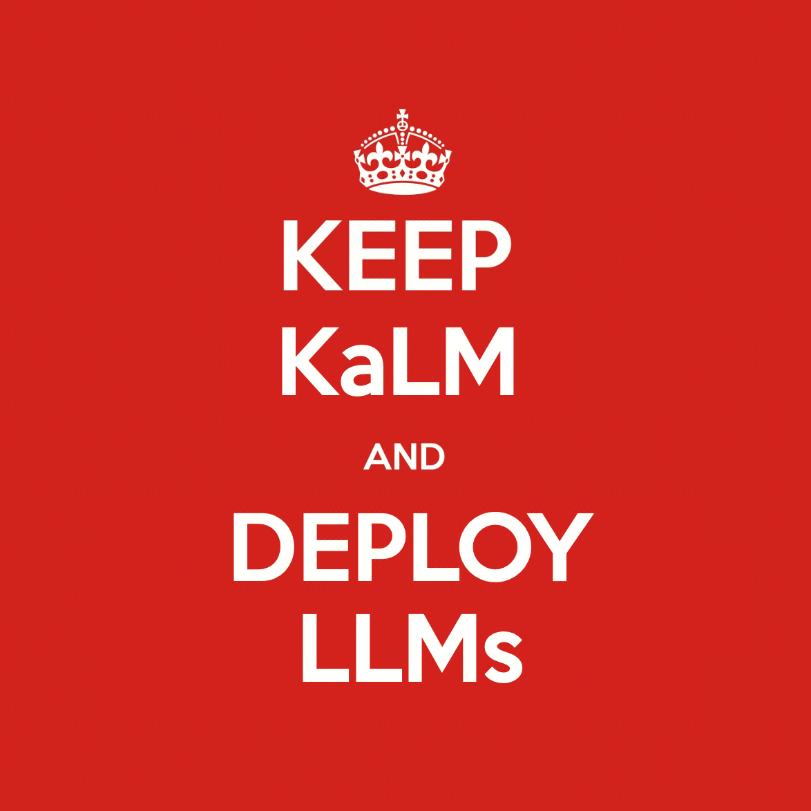

<h1 align="center">KaLM-Embedding</h1>

<!-- <div style="text-align: center;">
  
</div> -->


<div align="center">

  [Overview](https://github.com/HITsz-TMG/KaLM-Embedding/tree/main?tab=readme-ov-file#sparkles-overview) | [Usage](https://github.com/HITsz-TMG/KaLM-Embedding/tree/main?tab=readme-ov-file#computer-usage) | [Acknowledgements](https://github.com/HITsz-TMG/KaLM-Embedding/tree/main?tab=readme-ov-file#loudspeaker-acknowledgements) | [Citation](https://github.com/HITsz-TMG/KaLM-Embedding/tree/main?tab=readme-ov-file#link-citation) | [License](https://github.com/HITsz-TMG/KaLM-Embedding/tree/main?tab=readme-ov-file#scroll-license)

</div>


## :sparkles: Overview

Code for training and evaluation of our [KaLM-Embedding](https://huggingface.co/collections/HIT-TMG/kalm-embedding-67316afa4c56f4fc1f58764b) models.

For a more comprehensive understanding of the technical details, please refer to our paper [KaLM-Embedding: Superior Training Data Brings A Stronger Embedding Model](https://arxiv.org/abs/2501.01028).


## :computer: Usage

### :rainbow: Environment

```
conda env create -f environment.yaml
conda activate kalm
```


### :pick: Hard-negative Mining with Filtering
```
bash ./scripts/hn_mine.sh
```
You can customize the `filter_topk` parameter to set the threshold of ranking consistency filtering.


### :fire: Train
```
bash ./scripts/train.sh
```


### :bar_chart: Evaluation
We have provided a code for evaluating MTEB using multiple GPUs, which allocates each task from the task set to a single GPU in a queue-based manner, thereby enhancing evaluation efficiency.
```
bash ./scripts/eval_mteb.sh
```

Below, we present a portion of the results from the MTEB study. For a more comprehensive analysis, please refer to our technical report.
| Model Name | Model Size | MTEB(zh) | MTEB(en) | MTEB(fr) | MTEB(pl) | avg
|:----:|:---:|:---:|:---:|:---:|:---:|:---:| 
| [multilingual-e5-large](https://huggingface.co/intfloat/multilingual-e5-large) | 560M | 58.54 | 60.89 | 55.64 | 60.08 | 58.79
| [bge-m3 (dense)](https://huggingface.co/BAAI/bge-m3) | 560M | 61.07 | 59.57 | 58.79 | **60.35** | 59.95
| [gte-multilingual-base (dense)](https://huggingface.co/Alibaba-NLP/gte-multilingual-base) | **305M** | 62.72 | 61.40 | 59.79 | 58.22 | 60.53
| [KaLM-embedding-multilingual-mini-v1](https://huggingface.co/HIT-TMG/KaLM-embedding-multilingual-mini-v1) | 494M | 62.31 | 61.87 | 60.59 | 54.79 | 59.89
| [KaLM-embedding-multilingual-mini-instruct-v1](https://huggingface.co/HIT-TMG/KaLM-embedding-multilingual-mini-instruct-v1) | 494M | 63.57 | 64.74 | **64.04** | 58.16 | **62.62**
| [KaLM-embedding-multilingual-mini-instruct-v1.5](https://huggingface.co/HIT-TMG/KaLM-embedding-multilingual-mini-instruct-v1.5) | 494M | **64.13** | **64.94** | 63.08 | 57.05 | 62.3


## :loudspeaker: Acknowledgements

Specifically, our training code was forked from [FlagOpen/FlagEmbedding](https://github.com/FlagOpen/FlagEmbedding/tree/1.1/FlagEmbedding/baai_general_embedding/finetune). We have made modifications to suit our specific needs, but the core functionality and structure are derived from their excellent work.
Please check out their repository for more details!


## :link: Citation
Please cite the repo if you use the model or code in this repo.

```
@article{hu2025kalm,
  title={KaLM-Embedding: Superior Training Data Brings A Stronger Embedding Model},
  author={Hu, Xinshuo and Shan, Zifei and Zhao, Xinping and Sun, Zetian and Liu, Zhenyu and Li, Dongfang and Ye, Shaolin and Wei, Xinyuan and Chen, Qian and Hu, Baotian and others},
  journal={arXiv preprint arXiv:2501.01028},
  year={2025}
}
```


## :scroll: License

This repository respects to MIT license.